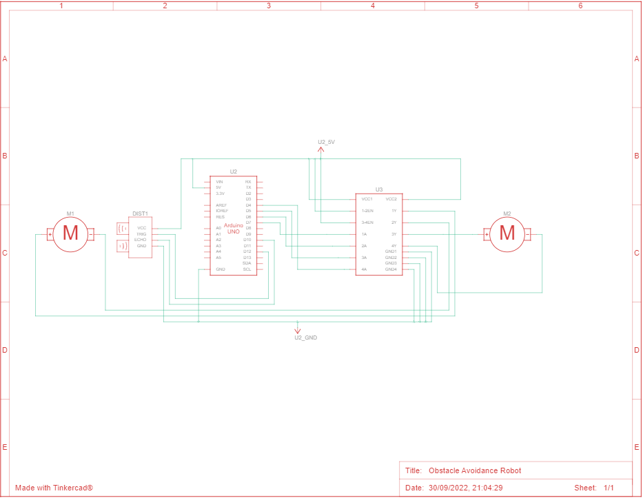

# Obstacle-Avoidance-Robot

## Materials Required 
| Name   | Quantity | Component                  |
|--------|----------|----------------------------|
| U3     | 1        | H-bridge Motor Driver      |
| U2     | 1        | Arduino Uno R3             |
| M1, M2 | 2        | Hobby Gearmotor            |
| DIST1  | 1        | Ultrasonic Distance Sensor |

## Schematic Diagram

